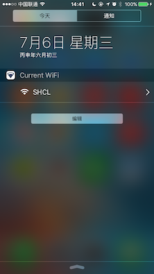

# JWiFi

Show the current connected WiFi in your notification center.
 
###这是一个通知中心小插件,用于在你的通知中心显示当前所连接的WiFi。

####需要在真机上测试方可显示所连WiFi。

(基于Xcode 7.3, Swift 2.2)

(support Xcode 8.0, Swift 3.0)

# screenshot

 

## Contacts

#####Email at: hi@jinxiansen.com

#####新浪微博 : [@晋先森](http://weibo.com/3205872327/)
#####Twitter : [@jinxiansen](https://twitter.com/jinxiansen)

## License

JWiFi is released under the MIT license. See LICENSE for details.